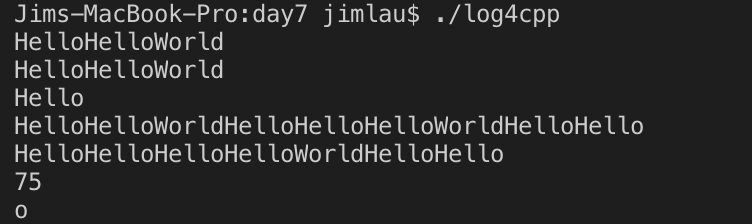

# C++

## 0. 什么是友元？友元的存在形式有？友元有何特点

友元函数可以访问类中的私有成员，友元分为友元函数和友元类两种，如果A是B的友元类，则A的成员函数可以访问B的私有成员。
友元函数和友元类不可继承，不可传递。

## 1. 运算符重载的原则是什么？有哪些规则

1. 与原有的运算符在内置类型上的行为一致，包括返回值、左结合/右结合，参数个数等。
2. 重载运算符`()`、`[]`、`->`或者赋值运算符`=`时，运算符重载函数必须声明为类的成员函数。
3. 不可定义新的运算符

## 2. 不能重载的运算符有哪几个

`{}`、`.`、`::`、`sizeof`

## 3. 运算符重载的形式有哪几种

1. 声明为友元，参数个数为运算符目数
2. 声明为成员函数，其参数个数为运算符目数减一

## 4. 自增运算符的前置形式和后置形式有什么区别?返回值类型分别是什么

1. 区别在于前置运算符的参数表无额外传参，后置形式有`int`传参，专门用于区分
2. 前置运算符的返回值为引用，而后置运算符的返回值为复制实参。

## 5. 实现String类的其它运算符的重载

```cpp
// include/strCls.hh
#include <cstring>
#include <iostream>

namespace str{
    class String
    {
    public:
        String();
        String(const char *);
        String(const String&);
        ~String();
        String &operator=(const String &);
        String &operator=(const char *);

        String &operator+=(const String &);
        String &operator+=(const char *);

        char &operator[](std::size_t index);
        const char &operator[](std::size_t index) const;

        std::size_t size() const;
        const char* c_str() const;

        friend bool operator==(const String &, const String &);
        friend bool operator!=(const String &, const String &);

        friend bool operator<(const String &, const String &);
        friend bool operator>(const String &, const String &);
        friend bool operator<=(const String &, const String &);
        friend bool operator>=(const String &, const String &);

        friend std::ostream &operator<<(std::ostream &os, const String &s);
        friend std::istream &operator>>(std::istream &is, String &s);

    private:
        char * _pstr;
    };

    String operator+(const String &, const String &);
    String operator+(const String &, const char *);
    String operator+(const char *, const String &);

    const int BLOCK_SIZE = 24;
} // namespace str
```

```cpp
// src/strCls.cc
#include "../include/strCls.hh"

using std::cout;
using std::cin;
using std::endl;

namespace str{

    /* 默认构造函数开辟 BLOCK_SIZE = 24 字节的空间 */
    String::String()
    {
        _pstr = new char[BLOCK_SIZE];
        bzero(_pstr, BLOCK_SIZE);
    }

    /* 类型转换构造函数方便传入C风格字符串 */
    String::String(const char * str)
    : _pstr(new char[strlen(str) + 1])
    {
        strcpy(_pstr, str);
    }

    /* 简单的复制构造函数 */
    String::String(const String& str)
    : _pstr(new char[strlen(str._pstr) + 1])
    {
        strcpy(_pstr, str._pstr);
    }

    /* 析构函数释放空间 */
    String::~String()
    {
        delete []_pstr;
        _pstr = nullptr;
    }

    /* 赋值重载函数，深拷贝 */
    String& String::operator=(const String &str)
    {
        _pstr = new char[strlen(str._pstr) + 1];
        strcpy(_pstr, str._pstr);
        return *this;
    }

    /* 重用以上赋值=、类型转换构造函数函数 */
    String& String::operator=(const char *str)
    {
        *this = String(str);
        return *this;
    }

    /* 拼接字符串 */
    String& String::operator+=(const String &str)
    {
        if(_pstr==nullptr || sizeof(_pstr) < strlen(_pstr) + strlen(str._pstr) + 1)
        {
            char * tmp = _pstr;
            tmp = new char[strlen(_pstr) + strlen(str._pstr) + BLOCK_SIZE + 1];
            sprintf(tmp, "%s%s", _pstr, str._pstr);
            if(_pstr)
                delete []_pstr;
            _pstr = tmp;
        } else {
            sprintf(_pstr, "%s%s", _pstr, str._pstr);
        }

        return *this;
    }


    /* 拼接C风格字符串 */
    String& String::operator+=(const char *str)
    {
        return *this += String(str);
    }

    /* 重载[]方便调用容器中的成员 */
    char &String::operator[](std::size_t index)
    {
        return _pstr[index];
    }

    /* const风格[]重载 */
    const char &String::operator[](std::size_t index) const
    {
        return _pstr[index];
    }

    /* 查看长度 */
    std::size_t String::size() const
    {
        return strlen(_pstr);
    }

    /* 传出只读的 C风格字符串 */
    const char* String::c_str() const
    {
        return _pstr;
    }

    /* 封装 strcmp 函数进行判断 */
    bool operator==(const String &s1, const String &s2)
    {
        return !strcmp(s1._pstr, s2._pstr);
    }

    /* 封装 strcmp 函数进行判断 */
    bool operator!=(const String &s1, const String &s2)
    {
        return !operator==(s1, s2);
    }

    /* 封装 strcmp 函数进行判断 */
    bool operator<(const String &s1, const String &s2)
    {
        return strcmp(s1._pstr, s2._pstr) < 0;
    }

    /* 封装 strcmp 函数进行判断 */
    bool operator>(const String &s1, const String &s2)
    {
        return strcmp(s1._pstr, s2._pstr) > 0;
    }

    /* 封装 strcmp 函数进行判断 */
    bool operator<=(const String &s1, const String &s2)
    {
        return strcmp(s1._pstr, s2._pstr) <= 0;
    }

    /* 封装 strcmp 函数进行判断 */
    bool operator>=(const String &s1, const String &s2)
    {
         return strcmp(s1._pstr, s2._pstr) >= 0;
    }

    /* 输出友元函数 */
    std::ostream& operator<<(std::ostream &os, const String &s)
    {
        return os<<s._pstr;
    }

    /* 输入友元函数 */
    std::istream& operator>>(std::istream &is, String &s)
    {
        return is>>s._pstr;
    }

    /* 重载加法函数 */
    String operator+(const String &s1, const String &s2)
    {
        String tmp = s1;
        tmp += s2;
        return tmp;
    }

    /* 重载加法函数 */
    String operator+(const String &s1, const char *s2)
    {
        return s1 + String(s2);
    }

    /* 重载加法函数 */
    String operator+(const char *s1, const String &s2)
    {
        return String(s1) + s2;
    }
}
```

```cpp
// src/main.cc
#include "../include/strCls.hh"

using std::cout;
using std::cin;
using std::endl;
using namespace str;

int main()
{
    const char *p = "Hello";
    String s1 = p, s2 = "World";
    s1 += p;
    s1 += s2;
    cout<<s1<<endl;
    s2 = s1;
    cout<<s2<<endl;
    s2 = p;
    cout<<s2<<endl;

    const String s3 = s1 + s2 + p;
    cout << s1 + p << s3<<endl;
    cout << p + s2 + s3<<endl;
    s2 += s3 + s1;
    cout << (p + s2 + s3).size()<<endl;

    cout << s3[11]<<endl;
    return 0;
}
```

测试结果如下：


